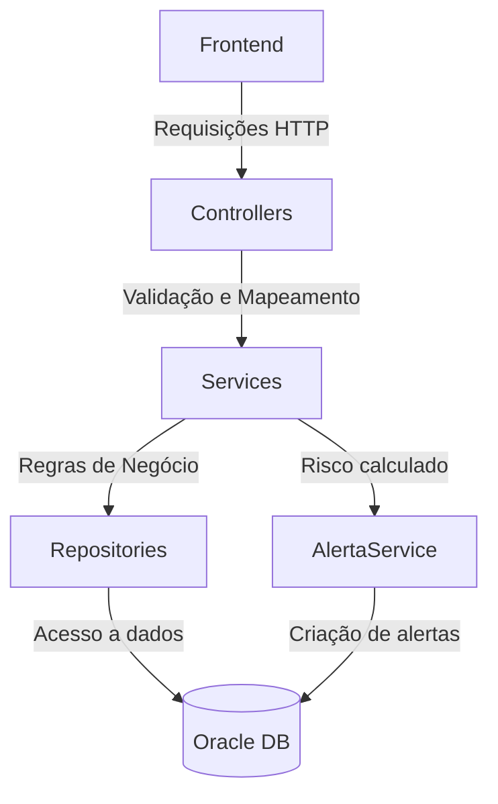

# 🌍 GeoAlertaC

API desenvolvida em .NET com foco na coleta e análise de dados climáticos para identificar riscos de deslizamento em determinadas regiões. O sistema recebe dados de sensores/meteo, armazena informações de usuários e endereços, e calcula o risco com base em regras predefinidas.

---

## 👥 Nome e RM dos Integrantes

- Guilherme Camasmie Laiber de Jesus – RM554894

- Fernando Fernandes Prado – RM557982

- Pedro Manzo Yokoo – RM556115


## 🛠️ Tecnologias Utilizadas

- ASP.NET Core
- C#
- Entity Framework Core
- Swagger (OpenAPI) para documentação
- Visual Studio 2022
- Oracle DataBase
- AutoMapper
- Migrations
- DataAnnotations

## 🧭 Visão Geral do Funcionamento

### Fluxo da API (.NET)



# 🚀 Como Executar o Projeto

## Execução Local

1. **Clone o repositório ou baixe ele**
    ```bash
    https://github.com/Gui11epio/GeoAlertaC.git
    ```

2. **Vá até "lauchSettings.json"**
   
   


3. **Coloque suas informações do Banco de Dados Oracle**

   


4. **Na terminal do projeto coloque as mesmas informações da Oracle**
    ```bash
    $env:CONEXAO_GS = "User Id=xxxxxxx;Password=xxxxxxx;Data Source=oracle.fiap.com.b:1521/ORCL";
    ```

5. **Ainda na terminal, rode este comando para criar as tabelas em seu banco de dados:**
     ```bash
     dotnet ef database update
     ```
6. **De um Build no seu projeto e o Swagger abrirá sozinho**


## ⚙️ Executar o Projeto pelo Render
No caso do Render vai ser utilizado o nosso banco de dados

Para o Postman:
```bash
https://geoalerta-java.onrender.com/
```

## 🗂️  Caminhos Disponíveis

📍 USUÁRIO

- Endpoint: GET/api/Usuario : **Pega todos os usuários**


- Endpoint: POST/api/Usuario : **Cadastra um usuário**
  

- Endpoint: GET/api/Usuario/{id} : **Pega usuário por Id**
  

- Endpoint: PUT/api/Usuario/{id} : **Atualiza o usuário por Id**
  

- Endpoint: DELETE/api/Usuario/{id} : **Deleta o usuário por Id**


- Endpoint: GET/api/Usuario/ObterPorEmail/{email} : **Pega todos os usuários**


📍 ENDEREÇO

- Endpoint: GET/api/Endereco : **Pega todos os endereços**

- Endpoint: POST/api/Endereco : **Cadastra um endereço**

- Endpoint: GET/api/Endereco/{id} : **Pega endereço por Id**

- Endpoint: PUT/api/Endereco/{id} : **Atualiza o endereço por Id**

- Endpoint: DELETE/api/Endereco/{id} : **Deleta o endereço por Id**


📍 ALERTA

- Endpoint: POST/api/Alerta : **Faz o alerta sobre os deslizamentos, usando o id do usuário e endereço**


