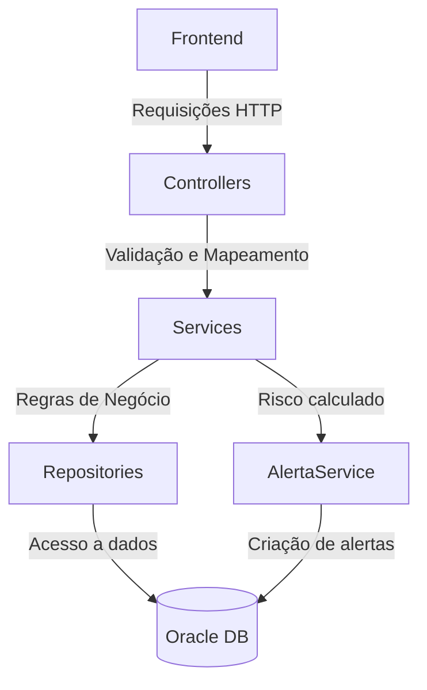

# 🌍 GeoAlertaC

API desenvolvida em .NET com foco na coleta e análise de dados climáticos para identificar riscos de deslizamento em determinadas regiões. O sistema recebe dados de sensores/meteo, armazena informações de usuários e endereços, e calcula o risco com base em regras predefinidas.

---

## 🧭 Visão Geral do Funcionamento

### Fluxo da API (.NET)



# 🚀 Como Executar o Projeto

## Pré-requisitos
.NET 7 SDK

Docker (opcional)

SQL Server (ou ajuste o appsettings.json para outro banco)

Execução Manual
```bash
$env:CONEXAO_GS = "User Id=xxxxxxx;Password=xxxxxxx;Data Source=oracle.fiap.com.b:1521/ORCL";
```
Execução com Docker
bash
Copiar
Editar
docker build -t geoalerta-api .
docker run -p 5000:80 geoalerta-api
