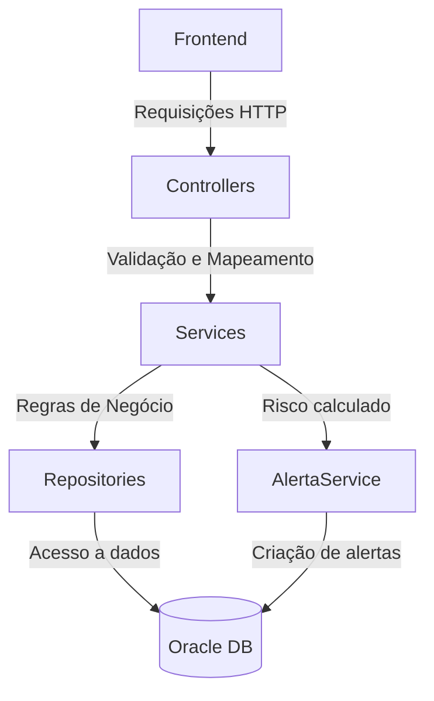

# 🌍 GeoAlertaC

API desenvolvida em .NET com foco na coleta e análise de dados climáticos para identificar riscos de deslizamento em determinadas regiões. O sistema recebe dados de sensores/meteo, armazena informações de usuários e endereços, e calcula o risco com base em regras predefinidas.

---

## 👥 Nome e RM dos Integrantes

- Guilherme Camasmie Laiber de Jesus – RM554894

- Fernando Fernandes Prado – RM557982

- Pedro Manzo Yokoo – RM556115


## 🛠️ Tecnologias Utilizadas

- ASP.NET Core
- C#
- Entity Framework Core
- Swagger (OpenAPI) para documentação
- Visual Studio 2022
- Oracle DataBase
- AutoMapper
- Migrations
- DataAnnotations
- Dockerfile(para o Render)

## 🧭 Visão Geral do Funcionamento

### Fluxo da API (.NET)



# 🚀 Como Executar o Projeto

## Execução Local

1. **Clone o repositório ou baixe ele**
    ```bash
    https://github.com/Gui11epio/GeoAlertaC.git
    ```

2. **Vá até "lauchSettings.json"**
   
   


3. **Coloque suas informações do Banco de Dados Oracle**

   


4. **Na terminal do projeto coloque as mesmas informações da Oracle**
    ```bash
    $env:CONEXAO_GS = "User Id=xxxxxxx;Password=xxxxxxx;Data Source=oracle.fiap.com.b:1521/ORCL";
    ```

5. **Ainda na terminal, rode este comando para criar as tabelas em seu banco de dados:**
     ```bash
     dotnet ef database update
     ```
6. **De um Build no seu projeto e o Swagger abrirá sozinho**


## ⚙️ Executar o Projeto pelo Render
No caso do Render vai ser utilizado o nosso banco de dados

Para o Postman:
```bash
https://geoalerta-java.onrender.com/
```

## 🗂️  Caminhos Disponíveis

📍 USUÁRIO

- Endpoint: GET/api/Usuario : **Pega todos os usuários**


- Endpoint: POST/api/Usuario : **Cadastra um usuário**
  

- Endpoint: GET/api/Usuario/{id} : **Pega usuário por Id**
  

- Endpoint: PUT/api/Usuario/{id} : **Atualiza o usuário por Id**
  

- Endpoint: DELETE/api/Usuario/{id} : **Deleta o usuário por Id**


- Endpoint: GET/api/Usuario/ObterPorEmail/{email} : **Pega todos os usuários**


📍 ENDEREÇO

- Endpoint: GET/api/Endereco : **Pega todos os endereços**

- Endpoint: POST/api/Endereco : **Cadastra um endereço**

- Endpoint: GET/api/Endereco/{id} : **Pega endereço por Id**

- Endpoint: PUT/api/Endereco/{id} : **Atualiza o endereço por Id**

- Endpoint: DELETE/api/Endereco/{id} : **Deleta o endereço por Id**


📍 ALERTA

- Endpoint: POST/api/Alerta : **Faz o alerta sobre os deslizamentos, usando o id do usuário e endereço**


## Jsons para testes

- Cadastro de Usuario
```bash
{
  "userName": "João Silva",
  "senha": "senhaSegura123",
  "email": "joao.silva@example.com",
  "telefone": "(11) 91234-5678"
}
```

- Para cadastrar o Endereço
```bash
{
  "bairro": "Centro",
  "cidade": "São Paulo",
  "usuarioId": 1
}
```

- Cadastro do Alerta
✅ 1. MUITO_BAIXO
```bash
{
  "chuva": 0,
  "umidade": 40,
  "temperatura": 28,
  "vento": 2,
  "nuvens": 20,
  "pressao": 1015,
  "usuarioId": 1,
  "enderecoId": 1
}
```
🔸Score ≈ 17.7 
🔸NivelRisco: MUITO BAIXO
🔸Descrição: "Chuvas leves. Nenhum risco visível."
🔸Probabilidade: 15


✅ 2. BAIXO
```bash
{
  "chuva": 4,
  "umidade": 65,
  "temperatura": 25,
  "vento": 6,
  "nuvens": 50,
  "pressao": 1005,
  "usuarioId": 1,
  "enderecoId": 1
}
```
Score ≈ 1.2 + 13 + 0.6 + 2.5 + 9.5 + 0 = 27.8
🔸NivelRisco: BAIXO
🔸Probabilidade: 15

✅ 3. MODERADO
```bash
{
  "chuva": 12,
  "umidade": 80,
  "temperatura": 22,
  "vento": 10,
  "nuvens": 70,
  "pressao": 995,
  "usuarioId": 1,
  "enderecoId": 1
}
```
Score ≈ 3.6 + 16 + 1 + 3.5 + 10.5 + 0 = 34.6
🔸NivelRisco: MODERADO
🔸Probabilidade: 40

✅ 4. ALTO
```bash
{
  "chuva": 25,
  "umidade": 85,
  "temperatura": 17,
  "vento": 20,
  "nuvens": 85,
  "pressao": 980,
  "usuarioId": 1,
  "enderecoId": 1
}
```
🔸Score ≈ 43.05 → MODERADO (quase ALTO)
🔸Probabilidade: 40
Aumente a Chuva ou abaixe mais a Temperatura para forçar ALTO

✅ 5. CRÍTICO
```bash
{
  "chuva": 50,
  "umidade": 95,
  "temperatura": 10,
  "vento": 30,
  "nuvens": 95,
  "pressao": 960,
  "usuarioId": 1,
  "enderecoId": 1
}
```
🔸Score ≈ 56.75 → ALTO

✅ 6. CRÍTICO (forçado)
Com Chuva e Temperatura mais extremas:
```bash
{
  "chuva": 100,
  "umidade": 100,
  "temperatura": 5,
  "vento": 40,
  "nuvens": 100,
  "pressao": 950,
  "usuarioId": 1,
  "enderecoId": 1
}
```
🔸Score ≈ 30 + 20 + 4 + 5 + 15 + 1.5 = 75.5 → CRÍTICO


